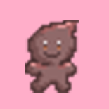
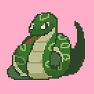

# 🌱 Folktale (Team 구황작물)

한국 전통 설화 세 편을 각기 다른 장르로 재구성한 2D 게임입니다.
C++와 SDL2로 제작한 게임프로그래밍 팀 프로젝트입니다.

<p align="center">
  
</p>

<p align="center">
  <a href="https://youtu.be/X3P6I48maRM">▶ 플레이 영상 보기</a>
</p>

---

## 목차

- [소개](#소개)
- [스테이지 구성](#스테이지-구성)
- [조작법](#조작법)
- [기술 스택](#기술-스택)
- [폴더 구조](#폴더-구조)
- [빌드 및 실행](#빌드-및-실행)
- [팀원](#팀원)

---

## 소개

**Folktale**은 강아지똥 · 토끼와 거북이 · 은혜 갚은 까치, 세 편의 한국 전통 설화를 모티프로 한
3스테이지 구성의 2D 게임입니다. 각 스테이지는 서로 다른 장르(디펜스 슈터 / 미로 회피 / 타워 서바이벌)로 만들어졌고,
스테이지마다 진행 방식에 따라 여러 개의 엔딩을 볼 수 있습니다. 감상한 엔딩은 갤러리에서 다시 볼 수 있습니다.

| 항목 | 내용 |
|---|---|
| 장르 | 2D 미니게임 모음 (스테이지별 장르 상이) |
| 플랫폼 | Windows (Win32) |
| 개발 언어 | C++ |
| 라이브러리 | SDL2, SDL2_image, SDL2_ttf, SDL2_mixer |
| 해상도 | 1080 x 720 |
| 목표 프레임 | 60 FPS |

## 스테이지 구성

<p align="center">
  
  
  
</p>

| | Stage 1 · 강아지똥 | Stage 2 · 토끼와 거북이 | Stage 3 · 은혜 갚은 까치 |
|---|---|---|---|
| 장르 | 고정형 디펜스 슈터 | 미로 회피 |  타워 서바이벌 |
| 플레이어 | 강아지똥 (이동 + 투사체 발사) | 거북이 (미로 이동) | 까치 (그리드 이동) |
| 지키는 대상 | 민들레 (고정) | 자기 자신 | 종 |
| 등장 적 | 병아리, 참새 | 소라게, 산호, 토끼 | 구렁이, 폭탄 |
| 핵심 규칙 | 쿨타임 있는 투사체로 적 저격 | 장애물 회피 + 무적 타이머 | 범위 폭발 판정 회피 |

## 조작법

| 키 | 기능 |
|---|---|
| `W` `A` `S` `D` | 이동 |
| `Space` | 공격 / 상호작용 (스테이지별 상이) |
| 마우스 클릭 | 메뉴 및 UI 버튼 선택 |

> 스테이지별 세부 조작은 각 스테이지 인트로 화면에서 안내됩니다.

## 기술 스택

- **언어**: C++
- **그래픽/입력/오디오**: [SDL2](https://www.libsdl.org/), SDL2_image, SDL2_ttf, SDL2_mixer
- **빌드 환경**: Visual Studio (`Folktale.sln`)
- **아키텍처**: `PhaseInterface`를 구현한 상태(Phase) 패턴으로 인트로 → 스테이지(인트로/게임/엔딩) → 갤러리 → 엔딩 전환 관리
- **엔티티 구조**: `Creature` 추상 클래스를 `Ally` / `Monster` / `bellAndRabbit`으로 상속하여 스테이지별 캐릭터 구현

## 폴더 구조

```
old-crop/
├── Folktale/          # 게임 소스 코드 (.cpp / .h)
├── Include/           # SDL2 헤더
├── Lib/               # SDL2 라이브러리 (.lib)
├── dll/               # SDL2 런타임 (.dll)
├── Resources/         # 이미지, 폰트, 사운드 에셋
│   ├── Intro/
│   ├── stage1/
│   ├── stage2/
│   ├── stage3/
│   └── gallery/
└── Folktale.sln       # Visual Studio 솔루션
```

## 빌드 및 실행

1. 저장소를 클론합니다.
   ```bash
   git clone https://github.com/mcmcjangn/old-crop.git
   ```
2. `Folktale.sln`을 Visual Studio로 엽니다.
3. `dll/` 폴더의 SDL2 관련 `.dll` 파일들이 실행 파일과 같은 경로에 있는지 확인합니다.
4. 빌드 후 실행합니다. (리소스는 상대 경로로 로드되므로 폴더 구조를 유지해주세요.)


---

<p align="center">🎮 <a href="https://youtu.be/X3P6I48maRM">게임 하이라이트 영상 보러가기</a></p>
